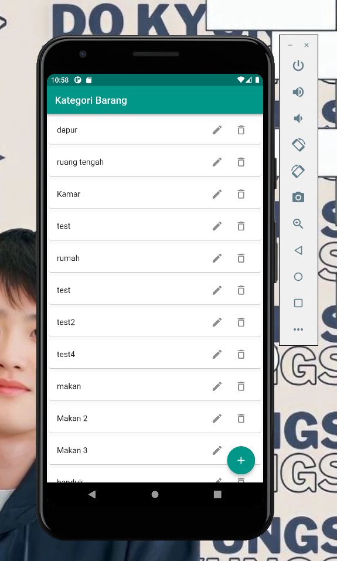
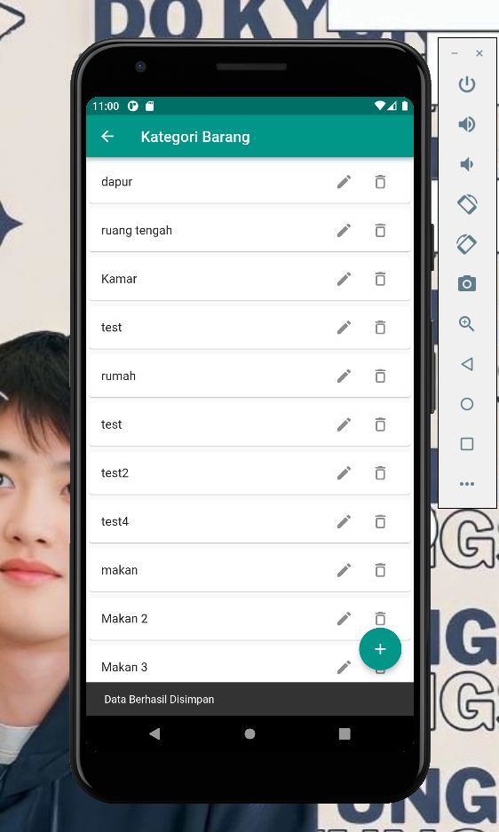
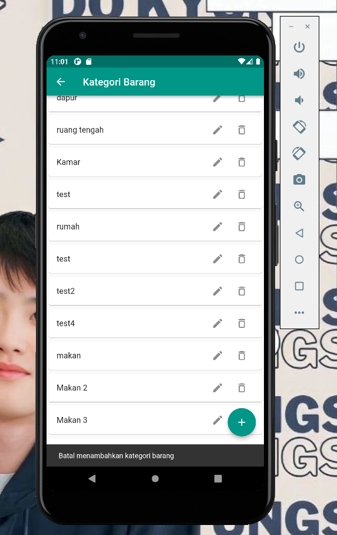
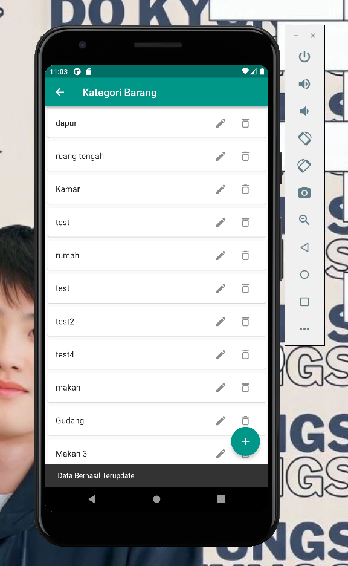
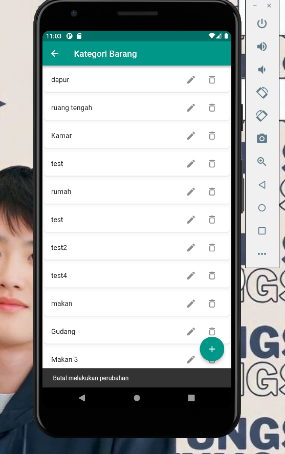
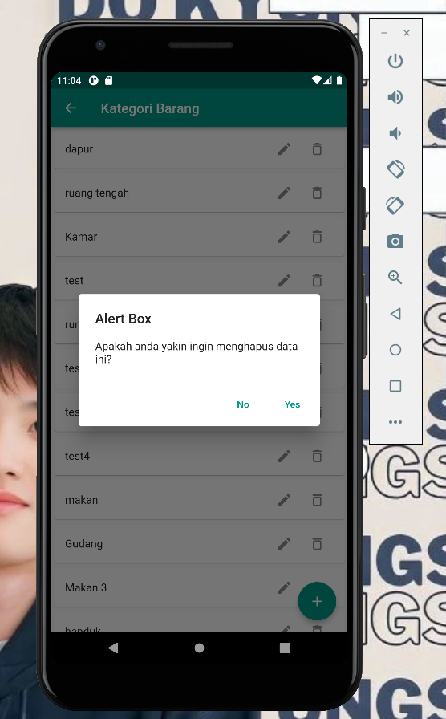
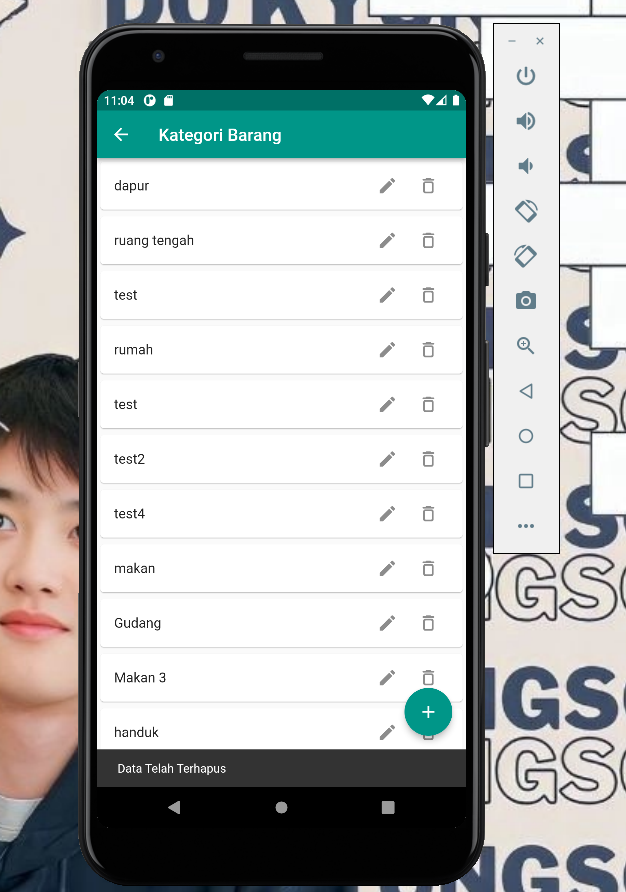

## 1. Tampil Semua Data

## 2. Tambah Data

## 3. Berhasil Add Data

## 4. Batal Add Data

## 5. Mengedit Data

## 6. Berhasil Update Data

## 7. Batal Update Data

## 8. Alert Ketika Mengklik Icon Delete

## 9. Menghapus Data

